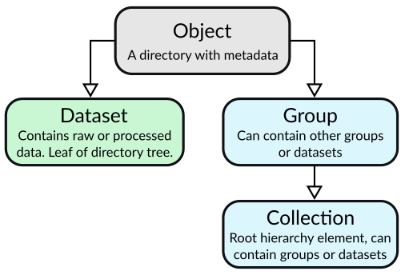
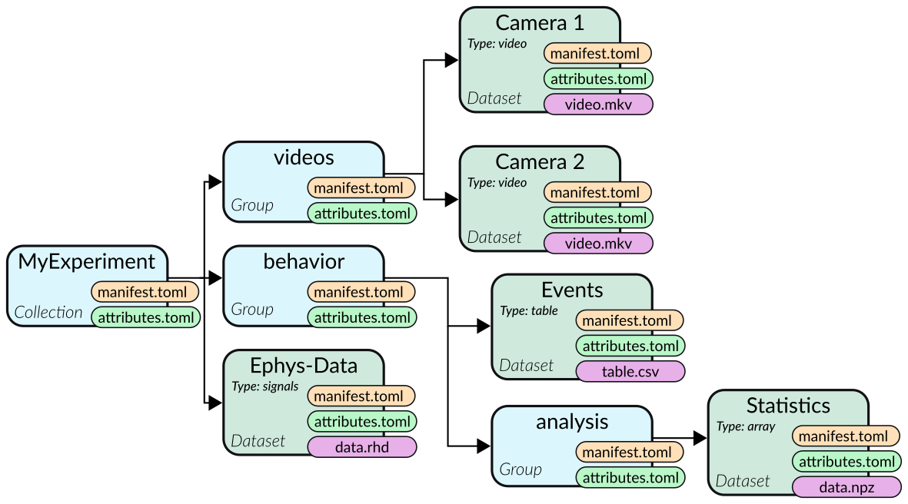

Introduction
############

Data storage is of much concern for researchers in every discipline, and a subject
of much debate with lots of solutions written.

At its core, a storage format of experiment data has to provide three things:

1. Provide an organizational structure for data, so it can be found again at a later
   date and be navigated easily by researchers who did not generate the data originally.
2. Permit safe archival of data that will be readable decades in the future and can ideally
   be processed with many existing tools.
3. Store metadata about the experiment and other descriptive information

In addition to that, a storage layout for raw experiment data also has to fulfill a few more
requirements:

4. Support datasets of multiple modalities: Electrophysiology, Tables, Matrices, Video recordings, ...
5. Allow massively parallel write and read access on the level of individual datsets

The EDL format is a specification for a storage layout for experiment data, with primary
focus on neuroscientific data. It was originally devised exclusively for the
`Syntalos <https://github.com/bothlab/syntalos>`_ DAQ system, which has governed many of
its design decisions.

Architecture Overview
=====================

Unlike file-based formats for data storage, EDL uses a hierarchy of directories to organize data into
logical groups. This permits it to not be limited to one mode of data storage, while also taking full
advantage of all performance optimizations done by the operating system at filesystem level when reading or
writing data. Additionally, writing to multiple datasets in parallel is possible naturally by means of
accessing individual files.

Collections, Groups and Datasets
--------------------------------

EDL distinguishes three fundamental organizational units for sorting data: **Collections**,
**Groups** and **Datasets**.
Each one of these units is represented on the filesystem by a directory containing a ``manifest.toml``
file in the `TOML <https://github.com/toml-lang/toml>`_ markup language which describes the unit type
and additional metadata about is contents.

A **Collection** is the highest organizational unit, similar to a file in single-file based data
storage schemes. It defines basic information, like the unique experiment ID and possible authors
of the data collection. A collection is never contained in any other EDL unit type.

A **Group** is a grouping of datasets or other groups. It never contains data on its own, and may
contain more groups for further hierarchical nesting, or datasets.

A **Dataset** contains the actual experiment data in one of the formats permitted in EDL. Dataset
directories represent leafs of the directory tree and will never contain more directories. A dataset
may have a unit of type group or collection as parent.

    Types of organizational units in EDL in an inheritance hierarchy

Metadata
--------

Metadata is stored in the `TOML <https://github.com/toml-lang/toml>`_ text-based human-readable markup language.
Fields that are generic and specified in EDL are stored in ``manifest.toml`` files in each directory, while the
experimenter can define and add arbitrary custom metadata in a separate ``attributes.toml`` file to describe a group,
collection or dataset.

Data
----

Experiment data must be stored in a set of well-defined formats, only one type of data is permitted per dataset.
In addition to allowing one primary type of data per dataset, EDL also permits the use of one additional "auxiliary"
type of data. This auxiliary data is usually closely tied to the primary data and describes additional information about
it, for example mapping of frame numbers to timestamps for videos, or timesync information for data acquired with Syntalos.

Example
-------

The following graph shows the use of all three organizational unit types in an example directory hierarchy.
Each node represents a new directory.

    Schema of an example EDL directory hierarchy

Comparison with Related Projects
================================

TODO
